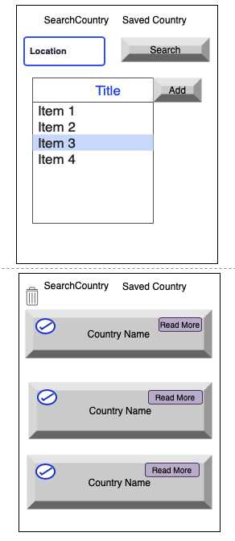

# Project #2: Simple React App

## Overview:
Country Informations React App.
The User Can Serach about Countries By Writing Country name.
## technologies used
 * React :
  A JavaScript library for building user interfaces.
 * CLI
 * postman
 * CSS library (IoIconPack) && Bootstrap
 * API (https://restcountries.eu/#api-endpoints-response-example) 
 * 3rd party libraries (IoIconPack).
 * React component library(BrowserRouter).
## wireframes :
This is sample representation of the structure and functionality of the web page

## Use Story:
* As a user, I should be able to Search about countries by name of the country
*  As a user, I should be able to Save 
 Country and ad it to List.
 * As a user, I should be able to Delete List of Countries from my list.
 * As a user, I should be able to Delete /Clear all Countries from my list.
 * As a user, I should be able to modify item name in the list.

 ##  Development process:

**Planning:** Create User story .

**Analysis and design :**

Design wireframes.

**Implement:** 
- Download the Requirements.
  * To create react app we need to Download packages and Tools using npm
    or Run packages without downloading using npx. 
     * (npx create-react-app  (app name)).
  * BrowserRouter is the router implementation for HTML5 browsers (vs Native). // Link is your replacement for anchor tags.
     * npm install react-router-dom

  *   axios is promise-based HTTP client that sports an easy-to-use API and can be used in both the browser and Node. js
      * npm install axios --save 
  * IoIconPack is utilizes ES6 imports that allows us to include icons
      * import IoIconPack from 'react-icons/lib/io'

**Testing:** 
Test Each function .

**Maintenance :**

...
## unsolved problems:
Save the data to localStorage or an API.

## Useful Resources
- **[React.js](https://reactjs.org/)**
- **[React Deployment Guide](https://github.com/gitname/react-gh-pages)**
- **[GA Repo](https://github.com/sei-entropy/project-2-prompt)** 
 

